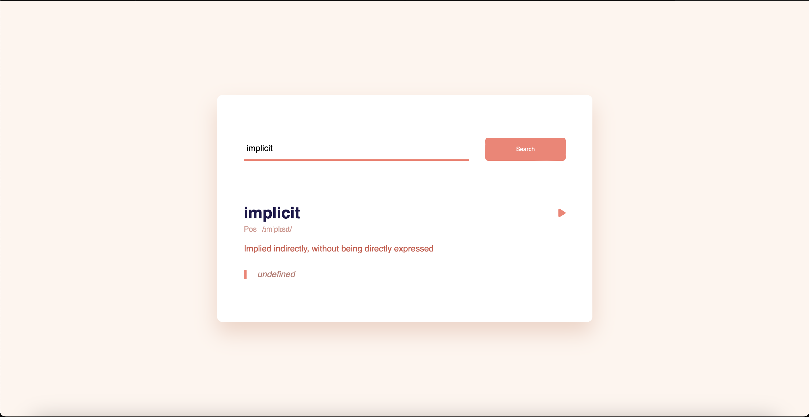

# Dict

## Dictionary made with the help of vanilla HTML, CSS and JS.

## Vanilla Dictionary

#### Vanilla Dictionary is a simple and lightweight web application built using vanilla HTML, CSS, and JavaScript.

#### With an intuitive user interface, this dictionary allows users to quickly search for definitions of words and expand their vocabulary effortlessly.

## Features:

#### User-Friendly Interface:

###### Enjoy a clean and straightforward interface that makes searching for words and accessing definitions a breeze.

###### It also enables you to listen to the pronounictaion of the word you are looking up without any added hassle.

#### Fast Search:

###### Instantly find definitions by typing in the search bar, with real-time suggestions as you type.

#### Responsive Design:

###### Access the dictionary seamlessly across various devices, including desktops, laptops, tablets, and smartphones.

### How to Use:

###### 1. Enter a word in the search bar.

###### 2. Press Enter or click on the search icon.

###### 3. View the definition of the word displayed instantly.
